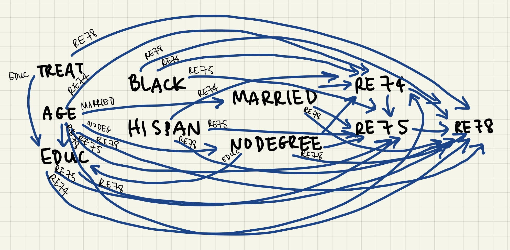

```{r setup, include=FALSE}
knitr::opts_chunk$set(echo = TRUE)
library(tidyverse)
library(mlogit)
library(personalized)
library(ggdag)
library(tableone)
library(jpeg)
```

# Part I
## 1: DAGs
```{r out.width = "100%", fig.align = "center"}

```

In the DAG, there are the following arrows:

* treatment has arrows going to re78 and educ. 
* age has arrows going to educ, re74, re75, re78, married, nodeg, educ
* educ has arrows going to re74, re75, re78
* black has arrows going to re74, re75, re78
* hispan has arrows going to re74, re75, re78
* married has arrows going to re74, re75, re78
* nodegree has arrows going to educ, re74, re75, re78
* re74 has arrows going to re75 and re78
* re75 has an arrow going to re78

## 2: Overall Covariate Balance
### Loading the Data
```{r}
hw3_data = read.csv("./hw3_data.csv")
```

```{r}
# Looking at overall covariate balance
names(hw3_data)
X = hw3_data[, !(colnames(hw3_data) %in% c("X"))]
head(X)

vars = c("age", "educ", "black", "hispan", "married", "nodegree", "re74", "re75")

tabpresub = CreateTableOne(vars = vars, strata = "treat", data = hw3_data, test = FALSE)
print(tabpresub, smd = TRUE)
```

## 3: Propensity Scores
```{r}
ps.model = glm(treat ~ age + educ + black + hispan + married + nodegree, data = hw3_data, family = binomial)

ps = predict(ps.model, type = "response")
```

## 4: Evaluating Propensity Scores and Trimming
```{r}
# Check Overlap
prop.func = function(x, trt)
{
  # fit propensity score model
  propens.model <- glm(treat ~ age + educ + black + hispan + married + nodegree, data = hw3_data, family = binomial)
  pi.x = predict(propens.model, type = "response")
  pi.x
}

check.overlap(x = hw3_data,
              trt = hw3_data$treat,
              type = "both",
              propensity.func = prop.func)
```

```{r results = FALSE}
# Trim non-overlap data
# eliminate controls for whom the P(A=1|C) is less that the min(P(A=1|C)) found in the treated group
min(ps[hw3_data$treat==1])
ps[which(hw3_data$treat==0)]<= min(ps[hw3_data$treat==1])

# eliminate treated for whom the P(A=1|C) is greater that the max(P(A=1|C)) found in the control group
max(ps[hw3_data$treat==0])
ps[which(hw3_data$treat==1)]>= max(ps[hw3_data$treat==0])

data = hw3_data[ps>=min(ps[hw3_data$treat==1]) & ps <= max(ps[hw3_data$treat==0]),] 
dim(hw3_data)
dim(data)
```

```{r}
# Check overlap again for trimmed data
ps.model = glm(treat ~ age + educ + black + hispan + married + nodegree, data = data, family = binomial)
summary(ps.model)

ps = predict(ps.model, type="response") #gets the propensity scores for each unit, based on the model

data$ps = ps

prop.func2 = function(x, trt)
{
  # fit propensity score model
  propens.model <- glm(treat ~ age + educ + black + hispan + married + nodegree + re74 + re75, data = data, family = binomial)
  pi.x <- predict(propens.model, type = "response")
  pi.x
}

check.overlap(x = data,
              trt = data$treat,
              type = "both",
              propensity.func = prop.func2)
```
Trimming the data resulted in `r 614 - 564` subjects trimmed, but this results in greater efficiency, since it increases the proportion of subjects able to be matched based on propensity score. However, generalizability is hurt because we have a fewer number of participants, and we are only using a selected number of participants.

## 5: Covariate Balance in Trimmed Sample
```{r}
tabpostsub = CreateTableOne(vars = vars, strata = "treat", data = data, test = TRUE)
print(tabpostsub, smd = TRUE)
```
The SMD of the variables educ, black, married, nodegree, re74, and re75 went down after trimming variables, while the rest of them went up. Some of the increases are not of concern, since the SMD is still below 0.2, but the race variables, married, re74, and re75 are still unbalanced since their SMD values are greater than 0.2.

## 6: Subclassification to Balance Covariates
The first attempt at subclassification using 5 subclasses:

```{r}
#creating subclasses
subclass.breaks = quantile(ps, c(.20, .40, .60, .80)) # bins (initial try - modify as needed)
subclass = data$ps
subclass = as.numeric(data$ps>subclass.breaks[1])
subclass[which(data$ps>subclass.breaks[1]& data$ps<=subclass.breaks[2])] = 1
subclass[which(data$ps>subclass.breaks[2]&data$ps<=subclass.breaks[3])] = 2
subclass[which(data$ps>subclass.breaks[3]&data$ps<=subclass.breaks[4])] = 3
subclass[which(data$ps>subclass.breaks[4])] = 4
#looking at sample sizes within each subclass
table(data$treat, subclass) #violates overlap
```

The subclasses are not balanced in terms of their treatment groups, and the overlap is violated, so we need a diffferent number of subclasses. Next, 4 subclasses will be used as an attempt for subclassification.

```{r}
# Too much overlap: try different subclass cutoffs
subclass.breaks = quantile(data$ps, c(.25, .50, .75))
subclass = data$ps
subclass = as.numeric(data$ps>subclass.breaks[1])
subclass[which(data$ps>subclass.breaks[1]& data$ps<=subclass.breaks[2])]<- 1
subclass[which(data$ps>subclass.breaks[2]&data$ps<=subclass.breaks[3])]<- 2
subclass[which(data$ps>subclass.breaks[3])]<- 3
table(data$treat, subclass)
```

This is a little more balanced in terms of the number in each group, but there are only 3 subjects with treatment 1 in subgroup 0, so we will attempt subclassification with 3 subclasses.

```{r}
subclass.breaks = quantile(data$ps, c(.4, .66))
subclass = data$ps
subclass = as.numeric(data$ps>subclass.breaks[1])
subclass[which(data$ps>subclass.breaks[1]& data$ps<=subclass.breaks[2])]<- 1
subclass[which(data$ps>subclass.breaks[2])]<- 2
table(data$treat, subclass)
```

Only using 3 subgroups with the cutoffs of 0.4 and 0.66 gives a slightly more balanced set of subjects than any of the other previous subclassifications. The density graphs and histograms will be examined, as well as overall covariate balance.

```{r}
#looking at propensity scores within subclasses
prop.func <- function(x, trt)
{
  data$ps[which(data$ps <= subclass.breaks[1])]
}
#data$ps <-ps
check.overlap(x = data[which(data$ps <=subclass.breaks[1]),],
              trt = data$treat[which(data$ps <= subclass.breaks[1])],
              type = "both",
              propensity.func = prop.func)

prop.func <- function(x, trt)
{
  data$ps[which(data$ps>subclass.breaks[1]&data$ps<=subclass.breaks[2])]
}
#data$ps <-ps
check.overlap(x = data[which(data$ps>subclass.breaks[1]&data$ps<=subclass.breaks[2]),],
              trt = data$treat[which(data$ps>subclass.breaks[1]&data$ps<=subclass.breaks[2])],
              type = "both",
              propensity.func = prop.func)

prop.func <- function(x, trt)
 {
   data$ps[which(data$ps>subclass.breaks[2])]
 }
check.overlap(x = data[which(data$ps>subclass.breaks[2]),],
              trt = data$treat[which(data$ps>subclass.breaks[2])],
              type = "both",
              propensity.func = prop.func)

# Check Covariate Balance
names(data)

tab_s0 <- CreateTableOne(vars = vars, strata = "treat", data = data[which(subclass==0),], test = FALSE)
tab_s1 <- CreateTableOne(vars = vars, strata = "treat", data = data[which(subclass==1),], test = FALSE)
tab_s2 <- CreateTableOne(vars = vars, strata = "treat", data = data[which(subclass==2),], test = FALSE)

## Show table with SMD
print(tab_s0, smd = TRUE)
print(tab_s1, smd = TRUE)
print(tab_s2, smd = TRUE)
```

Covariate Balance for Each Subclass:

* For subclass 0, the variables black and hispan are balanced, but the remainder have an SMD higher than 0.2, which is not ideal. This subclass was the one with the least balance in terms of treatment, though.
* For subclass 1, the variables nodegree, re74, and re75 have an SMD indicating covariate balance, with age, educ, and hispan not too far off. The variables black and married have particularly high SMDs, but the SMD for black is still much lower than the overall SMD.
* In subclass 2, all of the SMDs are below 0.2, indicating balance among all of the variables.

## 7: Marginal ACE of Participation on Wages
```{r}

```


## 8: Marginal ACE of Training and Salary
```{r}

```

## 9: Advantages and Disadvantages
The regression-based approach to confounding adjustment and the subclassification can be very powerfulwhen attempting to compare two unbalanced groups, because if we balance the groups on just the propensity score, then all covariates in the model are also balanced. This allows for direct comparison of two groups that otherwise would not have been able to be comparred. However, we must make sure that the data is balanced within particular subclasses before proceeding with analysis, and this can sometimes be tough to do depending on the data.

# Part II
## a: Non-parametric structural equations
### 1.

* Y = $f_Y$(L, A, $\epsilon_Y$)
* A = $f_A$(L, $\epsilon_A$)
* L = $f_L$($\epsilon_L$)

### 2.

* Y = $f_Y$(U, A, $\epsilon_Y$)
* A = $f_A$(L, $\epsilon_A$)
* L = $f_L$(U, $\epsilon_L$)
* U = $f_U$($\epsilon_U$)

### 3.

* Y = $f_Y$(U, $\epsilon_Y$)
* A = $f_A$($\epsilon_A$)
* L = $f_L$(A, U, $\epsilon_L$)
* U = $f_U$($\epsilon_U$)

### 4.

* Y = $f_Y$(L, A, $\epsilon_Y$)
* A = $f_A$(U, $\epsilon_A$)
* L = $f_L$(U, $\epsilon_L$)
* U = $f_U$($\epsilon_U$)

### 5. 

* Y = $f_Y$($U_1$, A, $\epsilon_Y$)
* A = $f_A$($U_2$, $\epsilon_A$)
* L = $f_L$($U_1$, $U_2$, $\epsilon_L$)
* $U_1$ = $f_U$($\epsilon_{U_1}$)
* $U_2$ = $f_U$($\epsilon_{U_2}$)

## b: Does conditioning on L properly adjust for confounding if we used the definition of confounder based on the backdoor criterion? Justify your answer.

1. No, because A has an arrow going to Y so that does not make A conditionally independent of Y given L.
2. No, because U has arrows going to both L and Y, and A still has an arrow going to Y, so neither variable is conditionally independent of Y given L.